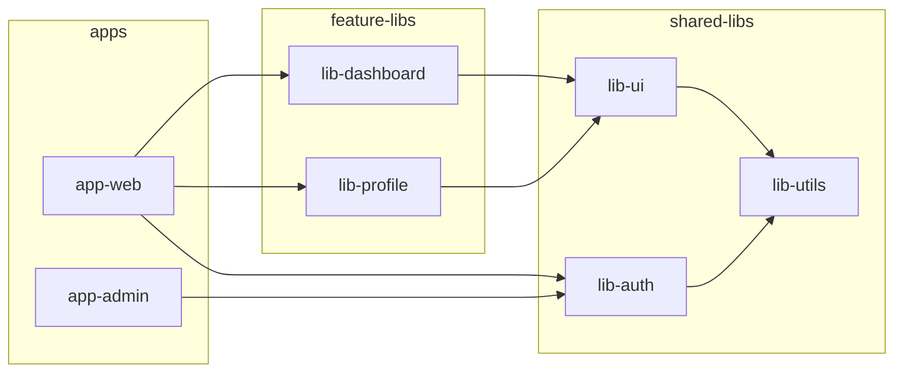
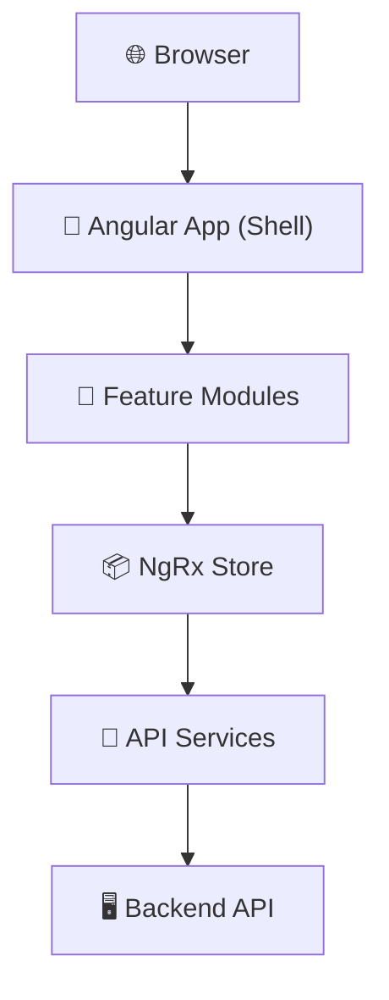
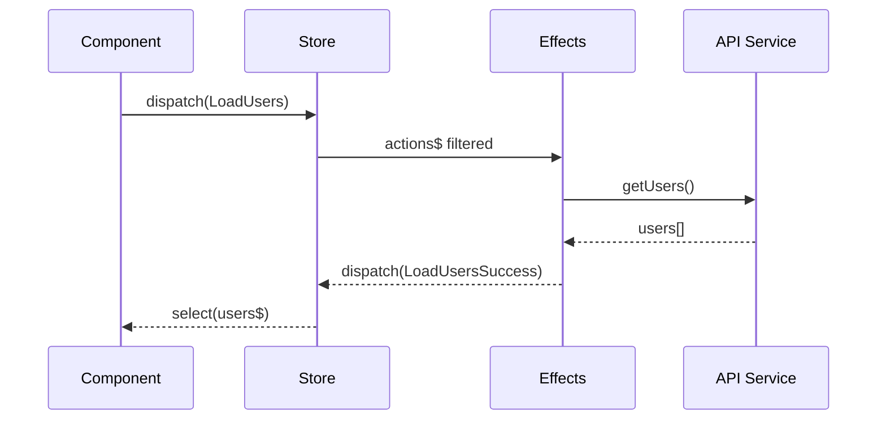
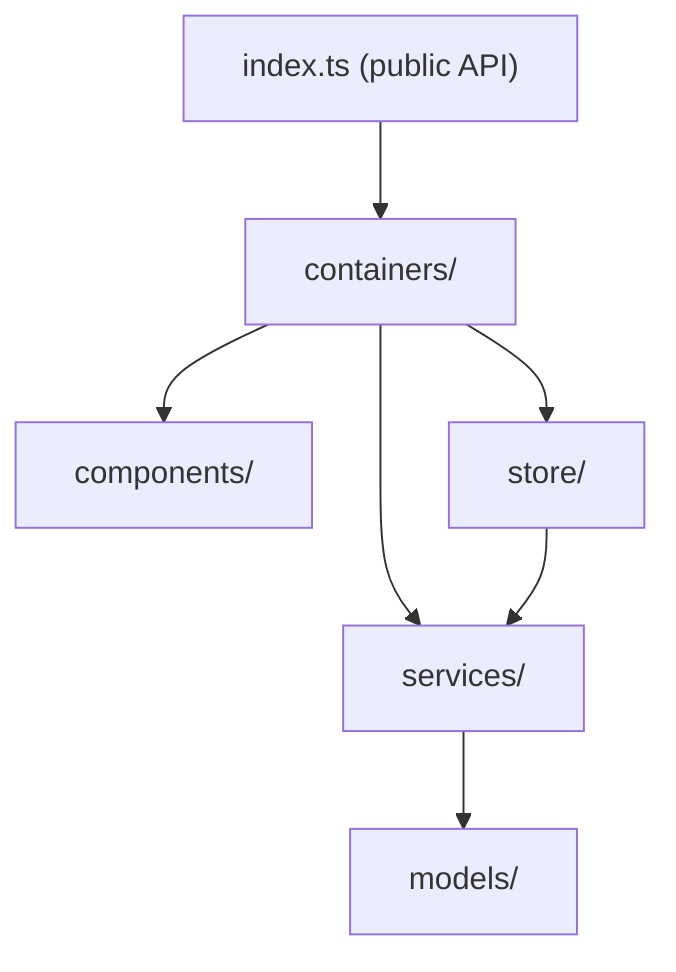
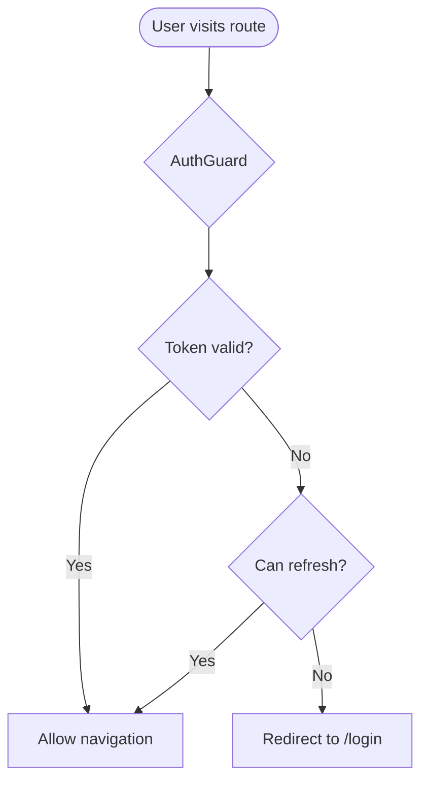
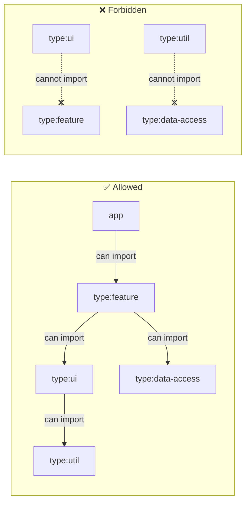

# Mermaid Patterns for Project Documentation

## Nx Dependency Graph

Use when: documenting which apps/libs depend on which.

## Layer Architecture

Use when: showing how the system is organized in layers.

## Data Flow (NgRx)

Use when: explaining state management flow.

## Feature Module Structure

Use when: showing internal structure of a feature lib.

## Auth Flow

Use when: documenting authentication.

## Module Boundary Rules (Nx tags)

Use when: showing which libs can import which.

